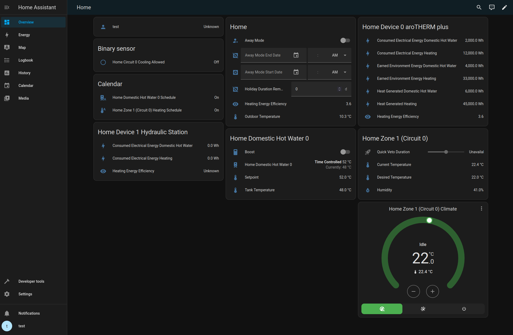

# myPyllant Home Assistant Component

[](https://github.com/signalkraft/mypyllant-component/releases)
[](https://github.com/signalkraft/mypyllant-component/blob/main/LICENSE)


Home Assistant component that interfaces with the myVAILLANT API (and branded versions of it, such as the MiGo Link app
from Saunier Duval & Bulex).

> [!WARNING] 
> This integration is not affiliated with Vaillant, the developers take no responsibility for anything that happens to
> your devices because of this library.
> 
> The [Vaillant API](https://health.vaillant-group.com/) has somewhat frequent incidents and strict quotas, which lead
> to errors in the integration.
> 
> For a completely local alternative, check out [signalkraft/ebusd-vaillant-component](https://github.com/signalkraft/ebusd-vaillant-component).


* [Documentation](https://signalkraft.com/mypyllant-component/)
* [Discussion on Home Assistant Community](https://community.home-assistant.io/t/myvaillant-integration/542610)
* [myPyllant Python library](https://github.com/signalkraft/mypyllant)

## Tested Setups

* Vaillant aroTHERM plus heatpump + sensoCOMFORT VRC 720 + sensoNET VR 921
* Vaillant ECOTEC PLUS boiler + VR940F + sensoCOMFORT
* Vaillant ECOTEC PLUS boiler + VRT380f + sensoNET
* Vaillant EcoCompact VSC206 4-5 boiler + Multimatic VRC700/6 + gateway VR920
* Saunier Duval DUOMAX F30 90 + MISET Radio + MiLink V3
* VR42 controllers are also supported
* [More are documented here](https://signalkraft.com/mypyllant-component/#tested-setups)

## Features



* Supports climate & hot water controls, as well as sensor information
* Control operating modes, target temperature, and presets such as holiday more or quick veto
* Set the schedule for climate zones, water heaters, and circulation pumps
  with [a custom service](https://signalkraft.com/mypyllant-component/2-services/#setting-a-time-program)
* Track sensor information of devices, such as temperature, humidity, operating mode, energy usage, or energy efficiency
* See diagnostic information, such as the current heating curve, flow temperature, firmware versions, or water pressure
* Custom services to set holiday mode or quick veto temperature overrides, and their duration

## Installation

### HACS

1. [Install HACS](https://hacs.xyz/docs/use/)
2. Search for the myVAILLANT integration in HACS and install it
3. Restart Home Assistant
4. [Add myVaillant integration](https://my.home-assistant.io/redirect/config_flow_start/?domain=mypyllant)
5. Sign in with the email & password you used in the myVAILLANT app (or MiGo app for Saunier Duval)

### Manual

1. Download [the latest release](https://github.com/signalkraft/mypyllant-component/releases)
2. Extract the `custom_components` folder to your Home Assistant's config folder, the resulting folder structure should
   be `config/custom_components/mypyllant`
3. Restart Home Assistant
4. [Add myVaillant integration](https://my.home-assistant.io/redirect/config_flow_start/?domain=mypyllant), or go to
   Settings > Integrations and add myVAILLANT
5. Sign in with the email & password you used in the myVAILLANT app (or MiGo app for Saunier Duval & Bulex)

## Options

### Seconds between scans

Wait interval between updating (most) sensors. **Don't set this too low, for example 10 leads to quota exceeded errors
and a temporary ban**.

The energy data and efficiency sensors have a fixed hourly interval.

### Delay before refreshing data after updates

How long to wait between making a request (i.e. setting target temperature) and refreshing data.
The Vaillant takes some time to return the updated values.

### Default duration in hours for quick veto

When setting the temperature with the climate controls, the integration uses the "quick veto" feature of the myVAILLANT
app.

With this option you can set for how long the temperature should stay set, before returning to the default value.

### Default duration in days for away mode

When the away mode preset is activated, this duration is used to for the end date (default is 365 days).

### Temperature controls overwrite time program instead of setting quick veto

When raising or lowering the desired temperature in the myVAILLANT app, it sets a quick veto mode for a limited time
with that new temperature, if the zone is in time controlled mode. If you want to permanently change the desired
temperature, you need to update the time schedule.

By default, this integration has the same behavior. But when enabling this option, the Home Assistant climate controls
instead overwrite the temperatures set in the time schedule with the new value (unless quick veto is already active).

### Country

The country you registered your myVAILLANT account in. The list of options is limited to known supported countries.

If a country is missing, please open an issue.

### Brand

Brand of your HVAC equipment and app, pick Saunier Duval if you use the MiGo Link app.

## Known Issues

### Lack of Test Data for Different Systems

Your HVAC system might differ from the ones in `Tested on` above.
If you don't see any entities, or get an error during setup, please check `Debugging` below and create an issue.
With debugging enabled, there's a chance to find the culprit in the data returned by the myVAILLANT API and fix it.

## Entities

You can expect these entities, although names will vary based on your home name (here "Home"),
installed devices (in this example "aroTHERM plus" and "hydraulic station"),
or the naming of your heating zones (in this case "Zone 1"):

| Entity                                                                        | Unit   | Class        | Sample                    |
|-------------------------------------------------------------------------------|--------|--------------|---------------------------|
| Home Trouble Codes                                                            |        | problem      | off                       |
| Home Online Status                                                            |        | connectivity | on                        |
| Home Firmware Update Required                                                 |        | update       | off                       |
| Home Firmware Update Enabled                                                  |        |              | on                        |
| Home EEBUS Enabled                                                            |        |              | on                        |
| Home EEBUS Capable                                                            |        |              | on                        |
| Home Circuit 0 Cooling Allowed                                                |        |              | on                        |
| Home Zone 1 (Circuit 0) Manual Cooling Active                                 |        |              | off                       |
| Home Zone 1 (Circuit 0)                                                       |        |              | on                        |
| Home Zone 1 (Circuit 0)                                                       |        |              | on                        |
| Home Domestic Hot Water 0                                                     |        |              | on                        |
| Circulating Water in Home Domestic Hot Water 0                                |        |              | off                       |
| Home Zone 1 (Circuit 0) Climate                                               |        |              | auto                      |
| Home Away Mode Start Date                                                     |        |              | unknown                   |
| Home Away Mode End Date                                                       |        |              | unknown                   |
| Home Manual Cooling Start Date                                                |        |              | unknown                   |
| Home Manual Cooling End Date                                                  |        |              | unknown                   |
| Home Holiday Duration Remaining                                               | d      |              | 0                         |
| Home Manual Cooling Duration                                                  | d      |              | 0                         |
| Home Zone 1 (Circuit 0) Quick Veto Duration                                   | h      |              | 2                         |
| Home Circuit 0 Heating Curve                                                  |        |              | 1.2733452                 |
| Home Circuit 0 Heat Demand Limited by Outside Temperature                     | °C     |              | 18.0                      |
| Home Circuit 0 Min Flow Temperature Setpoint                                  | °C     |              | 32.0                      |
| Vaillant API Request Count                                                    |        |              | 51                        |
| Home Outdoor Temperature                                                      | °C     | temperature  | 17.3                      |
| Home System Water Pressure                                                    | bar    | pressure     | 1.5                       |
| Home Firmware Version                                                         |        |              | 0357.40.35                |
| Home Zone 1 (Circuit 0) Desired Temperature                                   | °C     | temperature  | 0.0                       |
| Home Zone 1 (Circuit 0) Desired Heating Temperature                           | °C     | temperature  | 0.0                       |
| Home Zone 1 (Circuit 0) Desired Cooling Temperature                           | °C     | temperature  | 25.0                      |
| Home Zone 1 (Circuit 0) Current Temperature                                   | °C     | temperature  | 21.5                      |
| Home Zone 1 (Circuit 0) Humidity                                              | %      | humidity     | 62.0                      |
| Home Zone 1 (Circuit 0) Heating Operating Mode                                |        |              | Time Controlled           |
| Home Zone 1 (Circuit 0) Heating State                                         |        |              | Idle                      |
| Home Zone 1 (Circuit 0) Current Special Function                              |        |              | Quick Veto                |
| Home Circuit 0 State                                                          |        |              | STANDBY                   |
| Home Circuit 0 Current Flow Temperature                                       | °C     | temperature  | 41.0                      |
| Home Circuit 0 Heating Curve                                                  |        |              | 1.27                      |
| Home Domestic Hot Water 0 Tank Temperature                                    | °C     | temperature  | 51.5                      |
| Home Domestic Hot Water 0 Setpoint                                            | °C     | temperature  | 52.0                      |
| Home Domestic Hot Water 0 Operation Mode                                      |        |              | Time Controlled           |
| Home Domestic Hot Water 0 Current Special Function                            |        |              | Regular                   |
| Home Heating Energy Efficiency                                                |        |              | 4.9                       |
| Home Device 0 aroTHERM plus Heating Energy Efficiency                         |        |              | 4.9                       |
| Home Device 0 aroTHERM plus Consumed Electrical Energy Cooling                | Wh     | energy       | 0.0                       |
| Home Device 0 aroTHERM plus Consumed Electrical Energy Domestic Hot Water     | Wh     | energy       | 3000.0                    |
| Home Device 0 aroTHERM plus Consumed Electrical Energy Heating                | Wh     | energy       | 4000.0                    |
| Home Device 0 aroTHERM plus Earned Environment Energy Cooling                 | Wh     | energy       | 0.0                       |
| Home Device 0 aroTHERM plus Earned Environment Energy Domestic Hot Water      | Wh     | energy       | 9000.0                    |
| Home Device 0 aroTHERM plus Earned Environment Energy Heating                 | Wh     | energy       | 18000.0                   |
| Home Device 0 aroTHERM plus Heat Generated Heating                            | Wh     | energy       | 22000.0                   |
| Home Device 0 aroTHERM plus Heat Generated Domestic Hot Water                 | Wh     | energy       | 12000.0                   |
| Home Device 0 aroTHERM plus Heat Generated Cooling                            | Wh     | energy       | 0.0                       |
| Home Device 1 Hydraulic Station Heating Energy Efficiency                     |        |              | unknown                   |
| Home Device 1 Hydraulic Station Consumed Electrical Energy Domestic Hot Water | Wh     | energy       | 0.0                       |
| Home Device 1 Hydraulic Station Consumed Electrical Energy Heating            | Wh     | energy       | 0.0                       |
| Home Away Mode                                                                |        |              | off                       |
| Home EEBUS                                                                    |        |              | on                        |
| Home Manual Cooling                                                           |        |              | off                       |
| Home Domestic Hot Water 0 Boost                                               |        |              | off                       |
| Home Zone 1 (Circuit 0) Ventilation Boost                                     |        |              | off                       |
| Home Domestic Hot Water 0                                                     |        |              | Time Controlled           |

## Energy Statistics

In addition to the energy sensors listed above (which show *today's running total* for each
device and operation mode), the integration imports the myVAILLANT **hourly** energy data into
Home Assistant's long-term statistics. This is what powers correct per-hour attribution in the
**Energy Dashboard** — each hour's heat-pump consumption is recorded against the hour it
actually happened, not the time it was retrieved.

These statistics appear under external IDs of the form
`mypyllant:mypyllant_<system>_<device>_<operation>_<index>` (Developer Tools → Statistics), one
per energy sensor (e.g. *Consumed Electrical Energy Domestic Hot Water*, *... Heating*).

### How it works

* On each refresh, the daily-data coordinator fetches **two days** of hourly buckets
  (yesterday + today) from the myVAILLANT API and writes them as external statistics.
* `sum` is **cumulative and monotonically increasing** (it carries the previous day's running
  total forward), so the Energy Dashboard never shows a negative spike at midnight.
* `state` and `last_reset` reset at the start of **each** day, mirroring how other energy
  integrations (e.g. `octopus_energy`) model day-cumulative statistics.

### Why two days are fetched

The myVAILLANT API only returns a value for **completed** hours — the hour currently in
progress comes back as `null`. That includes the **final hour of the day** (23:00–00:00): at
23:55 it is still in progress, so it cannot be captured before midnight. Because the coordinator
re-fetches *yesterday* as well as today, a refresh shortly **after** midnight backfills that
final hour once it has finalised. Re-writing yesterday is idempotent (identical `sum` values),
so the only new row added is the previously-missing hour.

### Keeping the data up to date

> [!IMPORTANT]
> To avoid hitting the myVAILLANT API quota, the **daily energy data is *not* refreshed
> automatically** — it is only fetched once when the integration loads. You therefore need to
> trigger a refresh yourself to keep the hourly statistics current. There are two recommended
> approaches depending on whether you have hourly electricity metering in Home Assistant.

A refresh is triggered by calling `homeassistant.update_entity` on **any** of the integration's
energy / efficiency sensors (e.g. `sensor.home_device_0_arotherm_plus_heating_energy_efficiency`).
You can also set the **"Seconds between energy data updates"** option (`update_interval_daily`,
left empty by default) to poll on a fixed interval, but an automation gives you more control over
timing and quota.

Note that the myVAILLANT API finalises a completed hour a few minutes after it ends, so trigger
the refresh a little **past** the hour (`:15` works well) rather than exactly on the hour.

#### Option A — you have hourly electricity metering (recommended)

If Home Assistant knows your grid consumption (e.g. from a smart-meter / DNO integration), only
poll myVAILLANT when the heat pump has actually drawn power in the previous hour. This keeps API
usage low while capturing every active hour within ~1 hour.

First create a **helper** that reports your grid consumption over a rolling ~hour, using the
built-in [`statistics`](https://www.home-assistant.io/integrations/statistics/) platform. Point
it at an accumulative (monotonically increasing) consumption sensor in kWh:

```yaml
# configuration.yaml
sensor:
  - platform: statistics
    name: "Grid consumption rolling hour"
    unique_id: grid_consumption_rolling_hour
    entity_id: sensor.electricity_meter_accumulative_consumption  # your smart-meter kWh total
    state_characteristic: change      # net change over the buffered window
    max_age:
      minutes: 55
    sampling_size: 250
```

> If your consumption sensor resets at midnight, `change` may briefly read negative around the
> reset; the `above: 1` condition below simply won't fire then, which is harmless — the 00:30
> snapshot covers that boundary.

Then add an automation that refreshes at `:15` when the previous hour's consumption exceeded a
threshold (1 kWh is a good default — high enough to ignore base load, low enough to catch any
real heat-pump cycle), plus an **unconditional 00:30 snapshot** that backfills the previous day
in full:

```yaml
# automations.yaml
- id: mypyllant_energy_refresh
  alias: myVAILLANT - Refresh energy data
  description: >
    Refresh hourly energy at :15 when the previous hour's grid usage exceeded 1 kWh (so we
    only poll when the heat pump likely ran), plus an unconditional 00:30 daily snapshot that
    backfills the previous day's final hour.
  triggers:
    - trigger: time_pattern
      minutes: "15"
      id: hourly
    - trigger: time
      at: "00:30:00"
      id: snapshot
  conditions:
    - condition: or
      conditions:
        - condition: numeric_state
          entity_id: sensor.grid_consumption_rolling_hour
          above: 1
        - condition: trigger
          id: snapshot
  actions:
    - action: homeassistant.update_entity
      target:
        entity_id: sensor.home_device_0_arotherm_plus_heating_energy_efficiency
  mode: single
```

Because the daily snapshot reprocesses the whole previous day, any hour missed intraday (for
example a short cycle that didn't cross the 1 kWh threshold) is recovered automatically by the
next morning — daily totals are always correct.

#### Option B — no hourly metering

If you don't have an hourly grid-consumption sensor to gate on, simply refresh **once per day at
00:30**. Thanks to the two-day fetch, this pulls the *entire* previous day (now complete,
including its final hour) plus the current day so far. You get accurate per-hour data one day in
arrears:

```yaml
# automations.yaml
- id: mypyllant_energy_daily_refresh
  alias: myVAILLANT - Daily energy refresh
  description: Pull the full previous day's hourly energy at 00:30 (data lands one day in arrears).
  triggers:
    - trigger: time
      at: "00:30:00"
  actions:
    - action: homeassistant.update_entity
      target:
        entity_id: sensor.home_device_0_arotherm_plus_heating_energy_efficiency
  mode: single
```

### Visualising with Plotly Graph

The long-term statistics can be displayed as hourly bar charts using the
[Plotly Graph Card](https://github.com/dbuezas/lovelace-plotly-graph-card).

> [!NOTE]
> **Why not ApexCharts?** The popular ApexCharts card requires a standard entity ID for every
> series. It cannot query external statistics directly, which means you cannot mix a
> `mypyllant:` statistic (energy bars) with a normal temperature sensor in the same chart. Plotly
> Graph Card supports both in a single card via its `statistic:` option.

Because the statistics are external, each energy series must use `statistic: sum` with
`period: hour` and a `delta` filter to convert the cumulative sum into per-hour consumption
values. Find your statistic ID in **Developer Tools → Statistics** (filter by `mypyllant:`).

**Example — Domestic Hot Water energy vs tank temperature:**

```yaml
type: custom:plotly-graph
title: Hot Water ℃ vs Energy Usage
hours_to_show: 168
refresh_interval: auto
entities:
  - entity: sensor.home_domestic_hot_water_0_tank_temperature
    name: Tank Temperature
    line:
      color: "#e74c3c"
      width: 2
  - entity: mypyllant:mypyllant_<your_statistic_id>
    name: DHW Energy (Wh/h)
    unit_of_measurement: Wh
    statistic: sum
    period: hour
    type: bar
    yaxis: y2
    marker:
      color: rgba(52, 152, 219, 0.6)
    filters:
      - delta
      - map_y_numbers: Math.max(0, y)
layout:
  yaxis:
    title: Temperature (°C)
  yaxis2:
    title: Energy (Wh)
    overlaying: "y"
    side: right
    rangemode: tozero
    hoverformat: ".0f"
```

Key options:
- `statistic: sum` — reads from long-term statistics rather than entity state history.
- `delta` filter — converts the monotonically increasing `sum` into per-hour consumption.
- `map_y_numbers: Math.max(0, y)` — suppresses the rare small negative value that can appear at
  day boundaries while the baseline is being established.
- `unit_of_measurement: Wh` — required for the correct unit in the hover tooltip; external
  statistics don't expose their unit automatically to the card.
- `hoverformat: ".0f"` on `yaxis2` — displays whole-number Wh values in the tooltip.

## Services

There are custom services for almost every functionality of the myVAILLANT app:

| Name                                                                                                                                                          | Description                                                                     | Target       | Fields                                      |
|:--------------------------------------------------------------------------------------------------------------------------------------------------------------|:--------------------------------------------------------------------------------|:-------------|:--------------------------------------------|
| [Set quick veto](https://my.home-assistant.io/redirect/developer_call_service/?service=mypyllant.set_quick_veto)                                              | Sets quick veto temperature with optional duration                              | climate      | Temperature, Duration                       |
| [Set manual mode setpoint](https://my.home-assistant.io/redirect/developer_call_service/?service=mypyllant.set_manual_mode_setpoint)                          | Sets temperature for manual mode                                                | climate      | Temperature, Type                           |
| [Cancel quick veto](https://my.home-assistant.io/redirect/developer_call_service/?service=mypyllant.cancel_quick_veto)                                        | Cancels quick veto temperature and returns to normal schedule / manual setpoint | climate      |                                             |
| [Set holiday](https://my.home-assistant.io/redirect/developer_call_service/?service=mypyllant.set_holiday)                                                    | Set holiday / away mode with start / end or duration                            | climate      | Start Date, End Date, Duration              |
| [Cancel Holiday](https://my.home-assistant.io/redirect/developer_call_service/?service=mypyllant.cancel_holiday)                                              | Cancel holiday / away mode                                                      | climate      |                                             |
| [Set Zone Time Program](https://my.home-assistant.io/redirect/developer_call_service/?service=mypyllant.set_zone_time_program)                                | Updates the time program for a zone                                             | climate      | Type, Time Program                          |
| [Set Water Heater Time Program](https://my.home-assistant.io/redirect/developer_call_service/?service=mypyllant.set_dhw_time_program)                         | Updates the time program for a water heater                                     | water_heater | Time Program                                |
| [Set Water Heater Circulation Time Program](https://my.home-assistant.io/redirect/developer_call_service/?service=mypyllant.set_dhw_circulation_time_program) | Updates the time program for the circulation pump of a water heater             | water_heater | Time Program                                |
| [Export Data](https://my.home-assistant.io/redirect/developer_call_service/?service=mypyllant.export)                                                         | Exports data from the mypyllant library                                         |              | Data, Data Resolution, Start Date, End Date |
| [Generate Test Data](https://my.home-assistant.io/redirect/developer_call_service/?service=mypyllant.generate_test_data)                                      | Generates test data for the mypyllant library and returns it as YAML            |              |                                             |
| [Export Yearly Energy Reports](https://my.home-assistant.io/redirect/developer_call_service/?service=mypyllant.report)                                        | Exports energy reports in CSV format per year                                   |              | Year                                        |

Additionally, there are home assistant's built in services for climate controls, water heaters, and switches.

Search for "myvaillant" in Developer Tools > Services in your Home Assistant instance to get the full list plus an
interactive UI.

[](https://my.home-assistant.io/redirect/developer_call_service/?service=mypyllant.set_holiday)

## Contributing

See [the docs on contributing](https://signalkraft.com/mypyllant-component/3-contributing/).

### Debugging

When debugging or reporting issues, turn on debug logging by adding this to your `configuration.yaml`
and restarting Home Assistant:

```yaml
logger:
  default: warning
  logs:
    custom_components.mypyllant: debug
    myPyllant: debug
```

### Contributing to the underlying mypyllant library

See [this section on the contributing docs](https://signalkraft.com/mypyllant-component/3-contributing/#contributing-to-the-underlying-mypyllant-library).
