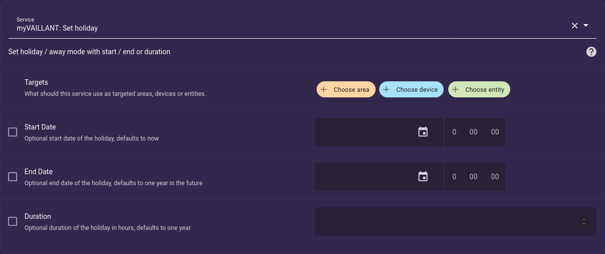

---
hide:
  - navigation
---

# Services

There are custom services to control holiday mode and quick veto temperatures for each climate zone.
Search for "myvaillant" in Developer Tools > Services in your Home Assistant instance to get the full list plus an interactive UI.

