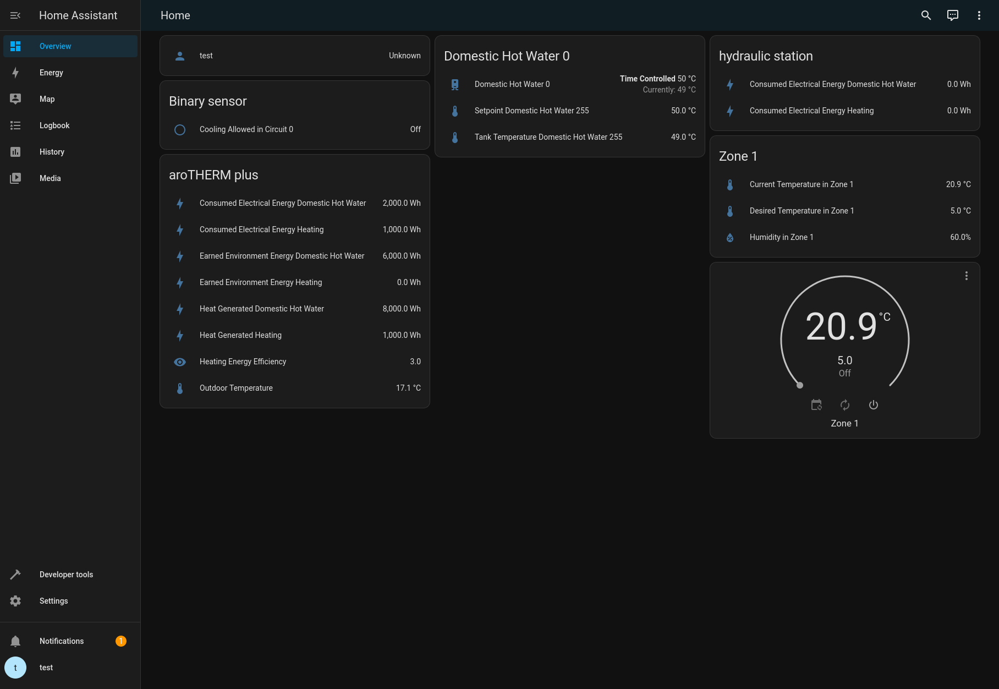

[{ align=right width="25%" }]()

# Getting Started

Home Assistant component that interfaces with the myVAILLANT API
(and branded versions of it, such as the MiGo Link app from Saunier Duval & Bulex).
Uses the [myPyllant Python library](https://github.com/signalkraft/mypyllant).

## Installation

!!! note

    1. The developers are not affiliated with Vaillant, we take no responsibility for anything that happens to your devices because of this library
    1. This integration is not compatible with systems that use sensoAPP and multiMATIC

### HACS

{ width="50%" align="right" }

1. [Install HACS](https://hacs.xyz/docs/setup/download)
2. Search for the myVAILLANT integration in HACS and install it
3. Restart Home Assistant
4. [Add myVaillant integration](https://my.home-assistant.io/redirect/config_flow_start/?domain=mypyllant)
5. Sign in with the email & password you used in the myVAILLANT app (or MiGo app for Saunier Duval)

Having problems? [Open an issue](https://github.com/signalkraft/mypyllant-component/issues/new/choose).

### Manual

1. Download [the latest release](https://github.com/signalkraft/mypyllant-component/releases)
2. Extract the `custom_components` folder to your Home Assistant's config folder, the resulting folder structure should
   be `config/custom_components/mypyllant`
3. Restart Home Assistant
4. [Add myVaillant integration](https://my.home-assistant.io/redirect/config_flow_start/?domain=mypyllant), or go to
   Settings :material-arrow-right: Integrations and add myVAILLANT
5. Sign in with the email & password you used in the myVAILLANT app (or MiGo app for Saunier Duval)

## Features

*    :material-sun-snowflake-variant:{ .lg .middle } Climate Controls

     ---

     Supports climate & hot water controls, as well as ventilation and circulation pumps

     [:material-arrow-right: Read more](2-entities.md#sample-entities)

*    :material-thermostat-auto:{ .lg .middle } Set Modes & Temperatures

     ---

     Control operating modes, target temperature, and presets such as holiday more or quick veto

     [:material-arrow-right: Read more](2-entities.md#climate-entities)

*    :material-calendar-sync:{ .lg .middle } Change Schedules

     ---

     Set the schedule for climate zones, water heaters, and circulation pumps
     with [a custom service](https://signalkraft.com/mypyllant-component/2-services/#setting-a-time-program) or [in the Home Assistant calendar](2-entities.md#calendar-entities)

     [:material-arrow-right: Read more](2-entities.md#calendar-entities)

*    :material-chart-line:{ .lg .middle } Track Data over Time

     ---

     Track sensor information of devices, such as temperature, humidity, operating mode, energy usage, or energy efficiency

    [:material-arrow-right: Read more](2-entities.md#sample-entities)

*    :material-hammer-screwdriver:{ .lg .middle } Diagnostic Data

     ---

     See diagnostic information, such as the current heating curve, flow temperature, firmware versions, or water pressure.
     Even values that are not available in the app, such as the current heating curve.

     [:material-arrow-right: Read more](2-entities.md#extra-state-attributes)

*    :material-home-automation:{ .lg .middle } Services & Automations

     ---

     Custom services to set holiday mode or quick veto temperature overrides, and their duration

     [:material-arrow-right: Read more](2-services.md)

## Tested Setups

* Vaillant aroTHERM plus heatpump + sensoCOMFORT VRC 720 + sensoNET VR 921
* Vaillant ECOTEC PLUS boiler + VR940F + sensoCOMFORT
* Vaillant ECOTEC PLUS boiler + VRT380f + sensoNET
* Vaillant ECOTEC PLUS VCW20/1 boiler + sensoCOMFORT VRC 720 + sensoNET VR 921
* Vaillant ECOTEC PLUS 296/5-5 (R6) + sensoCOMFORT VRC 720/2 + VR 70 (2 circuits) + sensoNET VR 921
* Vaillant ecoVIT + VIH R/6 uniSTORE + VR920
* Saunier Duval DUOMAX F30 90 + MISET Radio + MiLink V3
* Bulex Thema Condens F30/35 + Red 5 + MiPro Sense + MiLink v3

## Options

After setting up the integration, you can configure it further in Settings :material-arrow-right: Devices & Services :material-arrow-right: myVAILLANT :material-arrow-right: Configure.

### Seconds between scans

:   Wait interval between updating (most) sensors. The energy data and efficiency sensors have a fixed hourly interval.
    Setting this too low can cause "quota exceeded" errors.
    
    :material-cog: Default is 60 seconds.

### Delay before refreshing data after updates

:   How long to wait between making a request (i.e. setting target temperature) and refreshing data.
    The Vaillant API takes some time to return the updated values. Setting this too low will return the old values.
    
    :material-cog: Default is 5 seconds.

### Default duration in hours for quick veto

:   When setting the temperature with the climate controls, the integration uses the "quick veto" feature of the myVAILLANT
    app by default.
    
    With this option you can set for how long the temperature should stay set, before returning to the default value.

    :material-cog: Default is 3 hours.

### Default duration in days for away mode

:   When the away mode preset is activated, this duration is used to for the end date.

    :material-cog: Default is 365 days.

### Default temperature setpoint for away mode

:   When away mode is activated without a temperature (for example with the away mode switch), this value is set for all zones.

    :material-cog: Default is 10.0°C.

### Temperature controls overwrite time program instead of setting quick veto

:   When raising or lowering the desired temperature in the myVAILLANT app, it sets a quick veto mode for a limited time
    with that new temperature, if the zone is in time controlled mode. If you want to permanently change the desired
    temperature, you need to update the time schedule.

    By default, this integration has the same behavior. But when enabling this option, the Home Assistant climate controls
    instead overwrite the temperatures set in the time schedule with the new value.

    :material-cog: Default is off.

    !!! note
    
        If quick veto is active, the climate controls will always set the quick veto temperature.

### Country

:   The country you registered your myVAILLANT account in. The list of options is limited to known supported countries.

### Brand

:   Brand of your HVAC equipment and app, pick Saunier Duval if you use the MiGo Link app.

## Supported Brands & Countries

!!! note "Missing a Country?"

    If a country is missing, please [open an issue](https://github.com/signalkraft/myPyllant/issues/new/choose)
    or [contribute a new country to the myPyllant library](3-contributing.md#supporting-new-countries).

- Vaillant
    - Albania
    - Austria
    - Belgium
    - Bulgaria
    - Croatia
    - Czechia
    - Denmark
    - Estonia
    - Finland
    - France
    - Georgia
    - Germany
    - Greece
    - Hungary
    - Italy
    - Latvia
    - Lithuania
    - Luxembourg
    - Netherlands
    - Norway
    - Poland
    - Portugal
    - Romania
    - Serbia
    - Slovakia
    - Slovenia
    - Spain
    - Sweden
    - Switzerland
    - Ukraine
    - United Kingdom
    - Uzbekistan
- Saunier Duval
    - Austria
    - Czechia
    - Finland
    - France
    - Greece
    - Hungary
    - Italy
    - Lithuania
    - Poland
    - Portugal
    - Romania
    - Slovakia
    - Spain
- Bulex
    - Does not support country selection, just leave the option empty

## Known Issues

### Lack of Test Data for Different Systems

Your HVAC system might differ from the ones in [Tested Setups](#tested-setups) above.
If you don't see any entities, or get an error during setup, please check [Debugging](3-contributing.md#debugging) and
create an issue.
With debugging enabled, there's a chance to find the culprit in the data returned by the myVAILLANT API and fix it.

### Vaillant API is occasionally unavailable

The API this integration uses sometimes goes down. Before reporting an issue, check if the myVAILLANT app works normally.
If it doesn't, there's nothing we can do about it.

### Some features that are available on the controller or in the maintenance settings are not available

If you would like to request a new feature, please check that it's available in the myVAILLANT app first.
Some data (for example quiet mode or legionella protection) are not available in the app, and therefore
can't be supported by this integration.

### The modes in Home Assistant and the myVAILLANT app don't match

[Check the mapping of modes](2-entities.md#climate-entities) between Home Assistant and myVAILLANT.